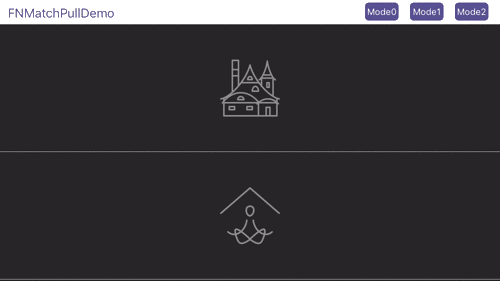

# FNMatchPull
A match character and pattern refresh control by Swift based in [CBStoreHouseRefreshControl](https://github.com/coolbeet/CBStoreHouseRefreshControl).

Simplified Chinese is here [简体中文](https://github.com/Fnoz/FNMatchPull/blob/master/README.zh-CN.md).
###Demo：

####Style = .Pattern
Animation can be created by points.

```
let matchAnimator = FNMatchPullAnimator(frame: CGRectMake(0, 0, 320, 80))
matchAnimator.startPoints = [NSValue.init(CGPoint: CGPointMake(SCREENWIDTH/2 - 30, 25)),
                             NSValue.init(CGPoint: CGPointMake(SCREENWIDTH/2 - 30, 55))]
matchAnimator.endPoints = [NSValue.init(CGPoint: CGPointMake(SCREENWIDTH/2 - 15 - 30, 40)),
                           NSValue.init(CGPoint: CGPointMake(SCREENWIDTH/2 - 15 - 30, 40))]
tableView.addPullToRefreshWithAction({
    //refresh action
    }, withAnimator: matchAnimator)
```

####Style = .Text
Animation can be created by English letters. Line width can be defined by yourself.
```
let matchAnimator = FNMatchPullAnimator(frame: CGRectMake(0, 0, 320, 80))
matchAnimator.text = "FNOZ"
matchAnimator.lineWidth = 4.0
matchAnimator.style = .Text
tableView.addPullToRefreshWithAction({
    //refresh action
    }, withAnimator: matchAnimator)
```

###Effect：




###Source：
The Objective-C edition is [CBStoreHouseRefreshControl](https://github.com/coolbeet/CBStoreHouseRefreshControl) by [coolbeet](https://github.com/coolbeet).
Our FNMatchPull can transfer English letters to pattern direclty.
